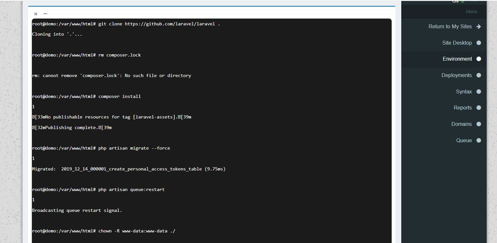

# Larahost

Provide hosting using Docker

## Features
### General
- Advanced user management
- Git Support
- Support webhooks for deployment
- Post deploy commands
- Attach Domain
- Auto Subdomain maker
- Deployment Logs
- User commands execution

### Laravel only
- Queue Manager
- Maintenance Mode
- ENV Editor 
- Log Viewer
- Auto migration
- Auto Composer install

# Live Demo
http://my.lara-host.ir/

#Screenshots

